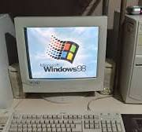

# Introdução a Linguagem de Marcação(MD)
## 2 Semestre 2026-DEV A
### Inicio com o Mark Down

Vamos iniciar falando sobre da hierarquia e estilos simples.

Exemplo de uso da estilização em negrito **Palavra de exemplo** utiliza-se **

Exemplo de uso da estilização em itálico *Palavra de exemplo* utiliza-se *

Exemplo de uso da estilização em tachado ~~Palavra de exemplo~~ utilizase ~~

Exemplo:

# **Lista de compra**

- Arroz
- Feijão
- Abacate
  - verde

1. Primeiro Passo
2. Segundo Passo

Acesse o [google](https://www.google.com.br)


Exemplo de trecho de código:
```javascript
function boasVindas(nome) {
 console.log(`ola, ${nome}!`);
}
```
## Exemplo de tabelas
| Recurso | Suporte | Status |
|:--- | :--- | :-- |
|html | sim | ativo |
| Markdown | sim | ativo |


